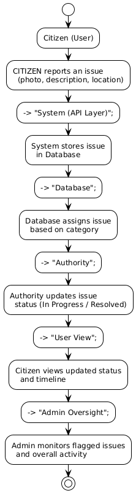

# **CivicTrack Functional Specification Document**

**Author:** Mahipal Singh Jhala  

---

## **1) Project Overview**

#### **Problem Statement**
Citizens face frequent civic issues such as potholes, garbage overflow, and broken streetlights.  
Existing reporting systems are inefficient and non-transparent, causing delays and loss of accountability.

#### **Objective**
CivicTrack provides a **digital, transparent platform** that connects citizens, authorities, and administrators for efficient issue reporting, tracking, and resolution.

#### **Scope**
- Role-based dashboards for Citizen, Authority, and Admin.  
- Issue reporting, tracking, and moderation workflows.  
- Secure access through authentication and SSL encryption.  
- Image upload and flagging features.

---

## **2) Proposed Solution**

CivicTrack enables efficient coordination between citizens and civic authorities.

1. Citizens report civic issues with photo, location, and description.  
2. The system assigns the issue to the respective authority department.  
3. Authorities update progress and resolution status.  
4. Admins oversee all activities and moderate flagged issues.

#### **Key Features**
- Simple and fast issue reporting.  
- Real-time issue tracking and updates.  
- Role-based access control.  
- Secure data flow over HTTPS.

---

## **3) User Roles**

| Role | Description |
|------|--------------|
| **Citizen** | Registers, reports issues, flags duplicates, views updates. |
| **Authority** | Handles assigned issues, updates progress, manages resolutions. |
| **Admin** | Manages users, authorities, categories, and moderation. |

---

## **4) Functional Components**

#### **i. Authentication & Authorization**

- Provides secure user login and role-based access.  
- Uses cookies for session handling to prevent token exposure.  
- Three main roles: Citizen, Authority, and Admin.  
- Passwords encrypted before storage.  
- Includes password change and logout options.  
- Ensures that users can access only permitted modules and data.

---

#### **ii. Issue Management**

- Citizens can create, update, and view their own issues.  
- Authorities update the issue status to *In Progress* or *Resolved*.  
- Admins have complete visibility over all issues.  
- Issues contain title, description, category, location, image, and timestamps.  
- Data managed through `user_issue`, `issue_images`, and related tables.

---

#### **iii. Flagging & Moderation**

- Citizens can flag spam or duplicate issues.  
- Flag data stored in `user_issue_flag`.  
- Issues automatically hidden after multiple flags.  
- Admin reviews flagged items and decides whether to hide or restore them.

---

#### **iv. Category & Department Management**

- Admins can create and edit categories such as Roads, Water, or Sanitation.  
- Each category is linked to a department via `authority_issue`.  
- Authority users are associated with specific departments using `authority_user`.

---

## **5) Tech Stack**

#### **Frontend**
- **React.js (Vite)** – Component-based architecture for fast UI rendering.  
- **Tailwind CSS** – Modern, responsive design.  
- **PWA Support** – Installable and mobile-friendly.

#### **Backend**
- **Node.js + Express.js** – RESTful API layer and routing.  
- **Sequelize ORM** – PostgreSQL integration.  
- **Multer + AWS SDK** – Image uploads to AWS S3.  
- **Helmet, CORS, Express Validator** – Security and input validation.

#### **Database**
- **PostgreSQL (AWS RDS)** – Secure and scalable relational data storage.

#### **Cloud & Hosting**
- **AWS EC2** – Application hosting (frontend + backend).  
- **AWS RDS** – Managed PostgreSQL database.  
- **AWS S3** – Image storage via pre-signed URLs.  
- **AWS Certificate Manager (ACM)** – SSL/TLS certificates for HTTPS.  
- **Route 53** – Domain and DNS management.

---

## **6) System Flow Overview**

#### **Example**
A citizen reports a garbage issue →     
System assigns it to Sanitation Authority →     
Authority marks it *In Progress* → then *Resolved* →     
Citizen receives updated status.

---

## **7) Non-Functional Considerations**

#### **Scalability**
- Stateless API supports horizontal scaling on EC2.  
- Database connection pooling for high concurrency.

#### **Security**
- HTTPS enforced via AWS Certificate Manager.  
- Password encryption using bcrypt.  
- Encrypted communication between EC2 and RDS.

#### **Performance**
- Indexed database queries for fast filtering.  
- Pre-signed URLs minimize API load for file transfers.

#### **Usability**
- Responsive and intuitive UI for all roles.  
- Consistent navigation and clear dashboards.

---

## **8) Security Overview**

- All communication over HTTPS (SSL from AWS ACM).  
- Cookies used for session authentication.  
- Passwords hashed and stored securely.  
- RDS connections encrypted (SSL mode).  
- Security groups restrict port access:  
  - `443` → HTTPS  
  - `80` → Redirect to HTTPS  
  - `5432` → Private DB access only

---

## **9) Future Vision**

- Push notifications for live updates.  
- Analytics dashboard for administrators.  
- OAuth/SSO login integration.  
- Refresh tokens for persistent sessions.  
- Two-Factor Authentication (2FA) for admins.
- Geolocation filtering of issue.

---
