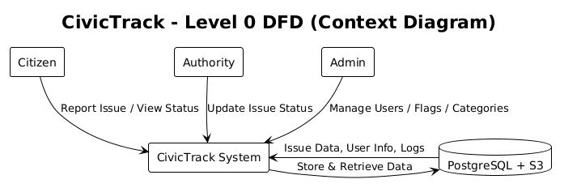

# **CivicTrack - Data Flow Diagrams (DFD)**

---

## **Level 0 DFD — Context Diagram**

The Level 0 DFD provides a high-level view of the system and its interactions with external entities.  
It represents the entire CivicTrack application as a single process and shows how data moves between the system and its users.

---

#### **Explanation**

| Entity | Description |
|---------|--------------|
| **Citizen** | Reports issues and views status updates. |
| **Authority** | Updates issue progress based on category. |
| **Admin** | Manages system users, categories, and moderation. |
| **Database** | Stores user details, issue reports, and logs. |

**Data Flow Summary:**
- Citizens submit reports → stored in the database.  
- Authorities update statuses → updates reflected for citizens.  
- Admin oversees all operations → manages flags and user permissions.  

---

## **Level 1 DFD**

This diagram expands the CivicTrack system into its main functional modules and illustrates internal data flow between entities, processes, and the database.

---

### **Explanation**

| Process ID | Process Name | Description |
|-------------|---------------|--------------|
| **1.0** | Authentication & Role Management | Handles login, signup, and role-based access control. |
| **2.0** | Issue Reporting | Citizens submit civic issues with photo, description, and location. |
| **3.0** | Issue Update & Logs | Authorities update issue progress and generate status logs. |
| **4.0** | Flagging & Moderation | Users flag spam/duplicates and admins review them. |
| **5.0** | Category Management | Admin manages categories and assigns authorities. |

**Data Flows:**
- User actions trigger process modules.  
- Each process reads/writes data in PostgreSQL or S3.  
- Responses are returned based on user role and permissions.  

---

