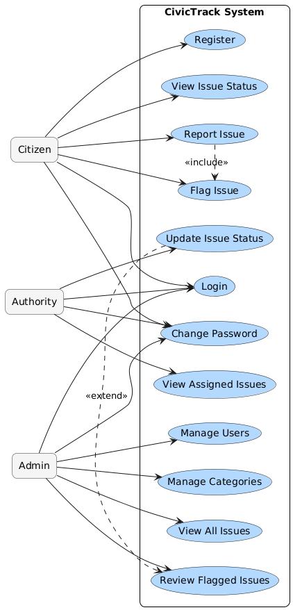

# **CivicTrack Use Case Document**

---

## **1) Overview**

This document describes the **primary system interactions (use cases)** of the CivicTrack application.  
Each use case defines the participating actors, system behavior, and expected outcomes.

---

## **2) Actors**

| Actor | Description |
|--------|-------------|
| **Citizen** | Registers, reports issues, flags duplicates, changes password, and views issue status. |
| **Authority** | Updates issue status and monitors issues assigned to their department. |
| **Admin** | Manages users, categories, departments, and reviews flagged issues. |
| **System** | Handles authentication, file storage (S3), and SSL-based secure communication. |

---

## **3) Use Case Diagram**

---

## **4) Use Cases**

#### **UC-01: Register User**

**Actor:** Citizen  
**Goal:** To create a new user account.  
**Precondition:** User provides valid registration details (name, email, password).  
**Main Flow:**.  
  1. Citizen navigates to the registration form.  
  2. Enters personal details and submits.  
  3. System validates inputs and stores encrypted password in the database.  
  4. Confirmation message displayed upon successful registration.  
**Postcondition:** User account created with role = *Citizen*.

---

#### **UC-02: Login**

**Actor:** All user roles (Citizen, Authority, Admin)  
**Goal:** To authenticate and start a secure session.  
**Precondition:** User already registered.  
**Main Flow:**.   
  1. User enters email and password.  
  2. System verifies credentials from `users` table.  
  3. If valid, system generates a JWT and stores it in an HTTP-only cookie.  
  4. User redirected to their respective dashboard.  
**Postcondition:** User session established via secure cookie.

---

#### **UC-03: Report Issue**

**Actor:** Citizen  
**Goal:** To report a civic issue with details and image.  
**Precondition:** User must be logged in.  
**Main Flow:**.  
  1. User selects issue category and location.  
  2. Uploads image (optional) and adds a description.  
  3. System validates input and uploads image to AWS S3.  
  4. Issue is saved in `user_issue` table with status = *Reported*.  
  5. Assigned authority notified through dashboard.  
**Postcondition:** Issue created and visible to related authority and admin.

---

#### **UC-04: Update Issue Status**

**Actor:** Authority  
**Goal:** To mark progress or resolution of an issue.  
**Precondition:** Issue is assigned to the authority’s department.  
**Main Flow:**.  
  1. Authority views assigned issues.  
  2. Updates status (e.g., *In Progress* or *Resolved*).  
  3. System records update in `logs` table.  
  4. Citizen and admin see the updated status.  
**Postcondition:** Issue status updated and logged with timestamp.

---

#### **UC-05: Flag Issue**

**Actor:** Citizen  
**Goal:** To flag inappropriate or duplicate issues.  
**Precondition:** Citizen must be logged in.  
**Main Flow:**.    
  1. User views an issue they believe is spam or duplicate.  
  2. Clicks “Flag” and selects reason.  
  3. System saves entry in `user_issue_flag` table.  
  4. If an issue exceeds the flag threshold, it is auto-hidden until admin review.  
**Postcondition:** Flag recorded, issue visibility updated if threshold reached.

---

#### **UC-06: Review Flagged Issues**

**Actor:** Admin  
**Goal:** To moderate flagged issues.  
**Precondition:** At least one issue flagged by citizens.  
**Main Flow:**.   
  1. Admin opens flagged issues list.  
  2. Reviews details and decides whether to keep hidden or restore.  
  3. System updates issue’s visibility status in database.  
**Postcondition:** Issue visibility updated based on admin decision.

---

#### **UC-07: Manage Users**

**Actor:** Admin  
**Goal:** To manage user accounts and roles.  
**Precondition:** Admin logged in with required privileges.  
**Main Flow:**.     
  1. Admin views user list.  
  2. Can assign, modify, or revoke roles.  
  3. System updates user-role mapping in `user_role` table.  
**Postcondition:** User permissions updated in the system.

---

#### **UC-08: Change Password**

**Actor:** All users (Citizen, Authority, Admin)  
**Goal:** To securely change the current password.  
**Precondition:** User must be logged in.  
**Main Flow:**.   
  1. User opens "Change Password" form.  
  2. Enters current password and new password.  
  3. System validates current password and encrypts the new one using bcrypt.  
  4. Updates `users` table and clears existing session cookie.  
  5. User must log in again using the new password.  
**Postcondition:** Password changed and user re-authenticated.

---

## **5) Exception Scenarios**

| Use Case | Exception | System Response |
|-----------|------------|-----------------|
| Register / Login | Invalid input | Display error message |
| Report Issue | Missing data or invalid image | Prompt user to correct input |
| Update Status | Unauthorized user | Return `403 Forbidden` |
| Change Password | Wrong current password | Return error “Invalid credentials” |
| Flag Issue | Duplicate flag by same user | Reject and notify “Already flagged” |

---

## **6) Postconditions Summary**

| Use Case | Result |
|-----------|--------|
| UC-01 | User account created |
| UC-02 | Session started (cookie issued) |
| UC-03 | Issue created in DB |
| UC-04 | Issue status updated |
| UC-05 | Flag recorded |
| UC-06 | Issue visibility changed |
| UC-07 | User roles updated |
| UC-08 | Password changed and session cleared |

---

## **7) Assumptions**
- All communications are secured with **HTTPS** (SSL from AWS ACM).  
- Passwords are hashed before storage.  
- Role-based access ensures no unauthorized data access.  

---
